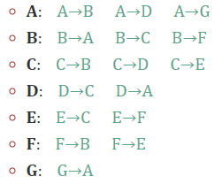

# 栅格和图

像 Dijkstra 算法和 A* 这样的图搜索算法适用于**加权有向图**，即由边连接的节点集，这些边连接有数字权重（移动成本）。这样的图搜索算法也可以在网格上工作吗？是的：网格可以看作是图形的特例。

栅格图（grid）如下所示：


图（graph）如下所示：


本文介绍了我们在基于图的寻路算法中使用的图论部分，以及如何用图表示网格。

## 图的属性

基于图形的寻路算法需要知道位置是什么以及哪些位置与其他位置相连。您通常知道的远不止这些，例如位置的大小和坐标，但算法实际上并不知道这些方面。它只知道连接是什么。


数学图是一组节点和边。节点（也称为顶点或对象）通过边（也称为链接或连接或箭头或弧）连接在一起。对于任何图形，我们需要知道两件事：

1. 图中的节点集
2. 每个节点的边集

上图是什么样的？

1. 节点集：A B C D E F G。

2. 每个节点的边集：

    

请注意，图形的布局不是图形的一部分。上图和下图是同一张图：


自己尝试一下：列出图中的节点，然后列出连接到每个节点的边。对于两个图表，您会得到相同的答案。

图搜索算法并不真正“理解”网格的布局或属性。他们只了解连通性。可以利用网格的附加属性的寻路算法可以比常规 A* 运行得更快。

让我们看看如何以图形形式对网格进行编码。

## 图形形式的网格

使用正方形网格时，我们需要制作一个节点列表。我们不限于矩形，但为简单起见，这里是 20x10 矩形的代码：

```python
all_nodes = []
for x in range(20):
    for y in range(10):
        all_nodes.append([x, y])
```

边缘将是四个方向：东、北、西、南。对于任何节点，我们需要知道通过边连接到该节点的其他节点。我们称这些邻居为：

```python
def neighbors(node):
    dirs = [[1, 0], [0, 1], [-1, 0], [0, -1]]
    result = []
    for dir in dirs:
        result.append([node[0] + dir[0], node[1] + dir[1]])
    return result
```

如果你的游戏允许对角线移动，你将在 dirs 中有八个条目。

但是，我们只想返回可以移动到的节点，因此我们将添加一个检查：

```python
def neighbors(node):
    dirs = [[1, 0], [0, 1], [-1, 0], [0, -1]]
    result = []
    for dir in dirs:
        neighbor = [node[0] + dir[0], node[1] + dir[1]]
        if neighbor in all_nodes:
            result.append(neighbor)
    return result
```

另一种检查方法是确保坐标在范围内。这仅在地图为矩形时有效。这是我们之前生成的 20x10 地图的代码：

```python
def neighbors(node):
    dirs = [[1, 0], [0, 1], [-1, 0], [0, -1]]
    result = []
    for dir in dirs:
        neighbor = [node[0] + dir[0], node[1] + dir[1]]
        if 0 <= neighbor[0] < 20 and 0 <= neighbor[1] < 10:
            result.append(neighbor)
    return result
```

在实践中，我们会想要用额外的信息来注释图形，比如你是否可以走过一个正方形。

## 变种

我掩盖了如何处理边缘。在图论中，有几种处理边的方法：

- 无向图有两个方向的边。这对于游戏地图来说很常见。在前面的示例中，每条无向边（例如 B↔C）被列出两次，一次是 B→C，一次是 C→B。
- 有向图的边可以向一个方向移动，但不能向另一个方向移动。单向门、跳下窗台和传送门可以成为游戏中的单向边缘。一个图可以有边 B→C 而没有边 C→B。
- 多重图在相同节点之间可以有多个边。能够游泳过河或乘木筏过同一条河是游戏中的一个例子。节点 B 可能有不止一条边 B→C 通向节点 C。

此外，您可以使用额外信息注释节点和边。寻路算法中经常出现的一种注解是边权重。加权图允许在每条边上使用数字权重。在带权无向图中，我们可以将铺设的道路标记为权重 1，将曲折的森林路径标记为权重 4，以使探路者更喜欢这条路。在加权有向图中，我们可以将下坡边 B→C 标记为权重 2，将上坡边 C→B 标记为权重 5，以便于下坡行走。

## 障碍

我们如何以图形式表示网格的障碍？一般有以下三种策略：

1. **删除节点。**如果障碍物占据了网格方块，您可以从图中(all_nodes)删除这些节点 。您还需要删除相应的边，如果您使用“if neighbor in all_nodes”来测试是否添加了边，这会自动发生，但如果您正在测试 x/y 是否在范围内则不会。
2. **去除边缘。**如果障碍物占据了正方形之间的边界，您可以通过在 neighbors() 函数中添加额外的检查来从图中删除这些边。如果障碍物占据了方块，您可以移除通向这些方块的边缘。
3. **无限权重边。**如果障碍物占据了正方形之间的边界，您可以将这些边缘标记为 Infinity 作为权重。如果障碍物占据了方块，您可以将通向障碍物的边标记为具有无穷大的权重。在你的图形搜索功能中，你必须在访问以无穷大为代价的节点之前退出。

如果您想在构建图形后更改障碍，则更改权重可能会更容易。


# 使用C++实现寻路算法

## 创建implementation.cpp文件

文件中包含如下内容：

```c++
/*
 Sample code from https://www.redblobgames.com/pathfinding/a-star/
 Copyright 2014 Red Blob Games <redblobgames@gmail.com>
 
 Feel free to use this code in your own projects, including commercial projects
 License: Apache v2.0 <http://www.apache.org/licenses/LICENSE-2.0.html>
*/

#include <iostream>
#include <iomanip>
#include <unordered_map>
#include <unordered_set>
#include <array>
#include <vector>
#include <utility>
#include <queue>
#include <tuple>
#include <algorithm>
#include <cstdlib>

struct SimpleGraph {
  std::unordered_map<char, std::vector<char> > edges;

  std::vector<char> neighbors(char id) {
    return edges[id];
  }
};

SimpleGraph example_graph {{
    {'A', {'B'}},
    {'B', {'C'}},
    {'C', {'B', 'D', 'F'}},
    {'D', {'C', 'E'}},
    {'E', {'F'}},
    {'F', {}},
  }};

struct GridLocation {
  int x, y;
};

namespace std {
/* implement hash function so we can put GridLocation into an unordered_set */
template <> struct hash<GridLocation> {
  std::size_t operator()(const GridLocation& id) const noexcept {
    // NOTE: better to use something like boost hash_combine
    return std::hash<int>()(id.x ^ (id.y << 16));
  }
};
}


struct SquareGrid {
  static std::array<GridLocation, 4> DIRS;

  int width, height;
  std::unordered_set<GridLocation> walls;

  SquareGrid(int width_, int height_)
     : width(width_), height(height_) {}

  bool in_bounds(GridLocation id) const {
    return 0 <= id.x && id.x < width
        && 0 <= id.y && id.y < height;
  }

  bool passable(GridLocation id) const {
    return walls.find(id) == walls.end();
  }

  std::vector<GridLocation> neighbors(GridLocation id) const {
    std::vector<GridLocation> results;

    for (GridLocation dir : DIRS) {
      GridLocation next{id.x + dir.x, id.y + dir.y};
      if (in_bounds(next) && passable(next)) {
        results.push_back(next);
      }
    }

    if ((id.x + id.y) % 2 == 0) {
      // see "Ugly paths" section for an explanation:
      std::reverse(results.begin(), results.end());
    }

    return results;
  }
};

std::array<GridLocation, 4> SquareGrid::DIRS = {
  /* East, West, North, South */
  GridLocation{1, 0}, GridLocation{-1, 0},
  GridLocation{0, -1}, GridLocation{0, 1}
};

// Helpers for GridLocation

bool operator == (GridLocation a, GridLocation b) {
  return a.x == b.x && a.y == b.y;
}

bool operator != (GridLocation a, GridLocation b) {
  return !(a == b);
}

bool operator < (GridLocation a, GridLocation b) {
  return std::tie(a.x, a.y) < std::tie(b.x, b.y);
}

std::basic_iostream<char>::basic_ostream& operator<<(std::basic_iostream<char>::basic_ostream& out, const GridLocation& loc) {
  out << '(' << loc.x << ',' << loc.y << ')';
  return out;
}

// This outputs a grid. Pass in a distances map if you want to print
// the distances, or pass in a point_to map if you want to print
// arrows that point to the parent location, or pass in a path vector
// if you want to draw the path.
template<class Graph>
void draw_grid(const Graph& graph,
               std::unordered_map<GridLocation, double>* distances=nullptr,
               std::unordered_map<GridLocation, GridLocation>* point_to=nullptr,
               std::vector<GridLocation>* path=nullptr,
               GridLocation* start=nullptr,
               GridLocation* goal=nullptr) {
  const int field_width = 3;
  std::cout << std::string(field_width * graph.width, '_') << '\n';
  for (int y = 0; y != graph.height; ++y) {
    for (int x = 0; x != graph.width; ++x) {
      GridLocation id {x, y};
      if (graph.walls.find(id) != graph.walls.end()) {
        std::cout << std::string(field_width, '#');
      } else if (start && id == *start) {
        std::cout << " A ";
      } else if (goal && id == *goal) {
        std::cout << " Z ";
      } else if (path != nullptr && find(path->begin(), path->end(), id) != path->end()) {
        std::cout << " @ ";
      } else if (point_to != nullptr && point_to->count(id)) {
        GridLocation next = (*point_to)[id];
        if (next.x == x + 1) { std::cout << " > "; }
        else if (next.x == x - 1) { std::cout << " < "; }
        else if (next.y == y + 1) { std::cout << " v "; }
        else if (next.y == y - 1) { std::cout << " ^ "; }
        else { std::cout << " * "; }
      } else if (distances != nullptr && distances->count(id)) {
        std::cout << ' ' << std::left << std::setw(field_width - 1) << (*distances)[id];
      } else {
        std::cout << " . ";
      }
    }
    std::cout << '\n';
  }
  std::cout << std::string(field_width * graph.width, '~') << '\n';
}

void add_rect(SquareGrid& grid, int x1, int y1, int x2, int y2) {
  for (int x = x1; x < x2; ++x) {
    for (int y = y1; y < y2; ++y) {
      grid.walls.insert(GridLocation{x, y});
    }
  }
}

SquareGrid make_diagram1() {
  SquareGrid grid(30, 15);
  add_rect(grid, 3, 3, 5, 12);
  add_rect(grid, 13, 4, 15, 15);
  add_rect(grid, 21, 0, 23, 7);
  add_rect(grid, 23, 5, 26, 7);
  return grid;
}

struct GridWithWeights: SquareGrid {
  std::unordered_set<GridLocation> forests;
  GridWithWeights(int w, int h): SquareGrid(w, h) {}
  double cost(GridLocation from_node, GridLocation to_node) const {
    return forests.find(to_node) != forests.end()? 5 : 1;
  }
};

GridWithWeights make_diagram4() {
  GridWithWeights grid(10, 10);
  add_rect(grid, 1, 7, 4, 9);
  typedef GridLocation L;
  grid.forests = std::unordered_set<GridLocation> {
    L{3, 4}, L{3, 5}, L{4, 1}, L{4, 2},
    L{4, 3}, L{4, 4}, L{4, 5}, L{4, 6},
    L{4, 7}, L{4, 8}, L{5, 1}, L{5, 2},
    L{5, 3}, L{5, 4}, L{5, 5}, L{5, 6},
    L{5, 7}, L{5, 8}, L{6, 2}, L{6, 3},
    L{6, 4}, L{6, 5}, L{6, 6}, L{6, 7},
    L{7, 3}, L{7, 4}, L{7, 5}
  };
  return grid;
}

template<typename T, typename priority_t>
struct PriorityQueue {
  typedef std::pair<priority_t, T> PQElement;
  std::priority_queue<PQElement, std::vector<PQElement>,
                 std::greater<PQElement>> elements;

  inline bool empty() const {
     return elements.empty();
  }

  inline void put(T item, priority_t priority) {
    elements.emplace(priority, item);
  }

  T get() {
    T best_item = elements.top().second;
    elements.pop();
    return best_item;
  }
};

template<typename Location, typename Graph>
void dijkstra_search
  (Graph graph,
   Location start,
   Location goal,
   std::unordered_map<Location, Location>& came_from,
   std::unordered_map<Location, double>& cost_so_far)
{
  PriorityQueue<Location, double> frontier;
  frontier.put(start, 0);

  came_from[start] = start;
  cost_so_far[start] = 0;
  
  while (!frontier.empty()) {
    Location current = frontier.get();

    if (current == goal) {
      break;
    }

    for (Location next : graph.neighbors(current)) {
      double new_cost = cost_so_far[current] + graph.cost(current, next);
      if (cost_so_far.find(next) == cost_so_far.end()
          || new_cost < cost_so_far[next]) {
        cost_so_far[next] = new_cost;
        came_from[next] = current;
        frontier.put(next, new_cost);
      }
    }
  }
}

template<typename Location>
std::vector<Location> reconstruct_path(
   Location start, Location goal,
   std::unordered_map<Location, Location> came_from
) {
  std::vector<Location> path;
  Location current = goal;
  if (came_from.find(goal) == came_from.end()) {
    return path; // no path can be found
  }
  while (current != start) {
    path.push_back(current);
    current = came_from[current];
  }
  path.push_back(start); // optional
  std::reverse(path.begin(), path.end());
  return path;
}

GridWithWeights make_diagram_nopath() {
  GridWithWeights grid(10, 10);
  add_rect(grid, 5, 0, 6, 10);
  return grid;
}

inline double heuristic(GridLocation a, GridLocation b) {
  return std::abs(a.x - b.x) + std::abs(a.y - b.y);
}

template<typename Location, typename Graph>
void a_star_search
  (Graph graph,
   Location start,
   Location goal,
   std::unordered_map<Location, Location>& came_from,
   std::unordered_map<Location, double>& cost_so_far)
{
  PriorityQueue<Location, double> frontier;
  frontier.put(start, 0);

  came_from[start] = start;
  cost_so_far[start] = 0;
  
  while (!frontier.empty()) {
    Location current = frontier.get();

    if (current == goal) {
      break;
    }

    for (Location next : graph.neighbors(current)) {
      double new_cost = cost_so_far[current] + graph.cost(current, next);
      if (cost_so_far.find(next) == cost_so_far.end()
          || new_cost < cost_so_far[next]) {
        cost_so_far[next] = new_cost;
        double priority = new_cost + heuristic(next, goal);
        frontier.put(next, priority);
        came_from[next] = current;
      }
    }
  }
}
```

##　广度优先搜索（Breadth First Search）算法

让我们从位置为字符的图形开始：

```c++
struct SimpleGraph {
  std::unordered_map<char, std::vector<char> > edges;

  std::vector<char> neighbors(char id) {
    return edges[id];
  }
};
```

请注意边是有向的：我们可以有一条从 A 到 B 的边，而没有一条从 B 到 A 的边。在游戏地图中，大多数边都是双向的，但有时会有单向门或悬崖跳下表示为有向的边缘。让我们从包含双向（two-way）和单向（one-way）链接的示例地图开始:


将地图转换为图形的一部分是选择要标记的位置。这里我决定将每个水平平台标记为一个位置。我们可以在图形中表示此示例，其中 Location 类型是字母 A、B、C、D、E 或 F。


```c++
SimpleGraph example_graph {{
    {'A', {'B'}},
    {'B', {'C'}},
    {'C', {'B', 'D', 'F'}},
    {'D', {'C', 'E'}},
    {'E', {'F'}},
    {'F', {}},
  }};
```

C++ 标准库已经包含一个队列类。我们现在有一个图 (SimpleGraph)、位置 (char) 和一个队列 (std::queue)。现在我们可以尝试广度优先搜索：

```c++
#include "redblobgames/pathfinding/a-star/implementation.cpp"

void breadth_first_search(SimpleGraph graph, char start) {
  std::queue<char> frontier;
  frontier.push(start);

  std::unordered_set<char> reached;
  reached.insert(start);

  while (!frontier.empty()) {
    char current = frontier.front();
    frontier.pop();

    std::cout << "  Visiting " << current << '\n';
    for (char next : graph.neighbors(current)) {
      if (reached.find(next) == reached.end()) {
        frontier.push(next);
        reached.insert(next);
      }
    }
  }
}


int main() {
  std::cout << "Reachable from A:\n";
  breadth_first_search(example_graph, 'A');
  std::cout << "Reachable from E:\n";
  breadth_first_search(example_graph, 'E');
}
```

运行结果：

```shell
Reachable from A:
  Visiting A
  Visiting B
  Visiting C
  Visiting D
  Visiting F
  Visiting E
Reachable from E:
  Visiting E
  Visiting F
```

网格也可以表示为图形。我现在将定义一个名为 SquareGrid 的新图，其中包含带有两个整数的位置结构。在此地图中，图中的位置（“状态”）与游戏地图上的位置相同，但在许多问题中，图位置与地图位置不同。我不会显式存储边，而是在 neighbors 函数中计算它们。在许多问题中，最好明确地存储它们。

```c++
struct GridLocation {
  int x, y;
};

namespace std {
/* implement hash function so we can put GridLocation into an unordered_set */
template <> struct hash<GridLocation> {
  std::size_t operator()(const GridLocation& id) const noexcept {
    // NOTE: better to use something like boost hash_combine
    return std::hash<int>()(id.x ^ (id.y << 16));
  }
};
}


struct SquareGrid {
  static std::array<GridLocation, 4> DIRS;

  int width, height;
  std::unordered_set<GridLocation> walls;

  SquareGrid(int width_, int height_)
     : width(width_), height(height_) {}

  bool in_bounds(GridLocation id) const {
    return 0 <= id.x && id.x < width
        && 0 <= id.y && id.y < height;
  }

  bool passable(GridLocation id) const {
    return walls.find(id) == walls.end();
  }

  std::vector<GridLocation> neighbors(GridLocation id) const {
    std::vector<GridLocation> results;

    for (GridLocation dir : DIRS) {
      GridLocation next{id.x + dir.x, id.y + dir.y};
      if (in_bounds(next) && passable(next)) {
        results.push_back(next);
      }
    }

    if ((id.x + id.y) % 2 == 0) {
      // see "Ugly paths" section for an explanation:
      std::reverse(results.begin(), results.end());
    }

    return results;
  }
};

std::array<GridLocation, 4> SquareGrid::DIRS = {
  /* East, West, North, South */
  GridLocation{1, 0}, GridLocation{-1, 0},
  GridLocation{0, -1}, GridLocation{0, 1}
};
```

在帮助程序文件 implementation.cpp 中，我定义了一个函数来制作网格：

```c++
#include "redblobgames/pathfinding/a-star/implementation.cpp"

int main() {
  SquareGrid grid = make_diagram1();
  draw_grid(grid);
}
```


让我们再次尝试广度优先搜索，跟踪 came_from：

```c++
#include "redblobgames/pathfinding/a-star/implementation.cpp"

template<typename Location, typename Graph>
std::unordered_map<Location, Location>
breadth_first_search(Graph graph, Location start) {
  std::queue<Location> frontier;
  frontier.push(start);

  std::unordered_map<Location, Location> came_from;
  came_from[start] = start;

  while (!frontier.empty()) {
    Location current = frontier.front();
    frontier.pop();

    for (Location next : graph.neighbors(current)) {
      if (came_from.find(next) == came_from.end()) {
        frontier.push(next);
        came_from[next] = current;
      }
    }
  }
  return came_from;
}

int main() {
  SquareGrid grid = make_diagram1();
  GridLocation start{7, 8};
  auto parents = breadth_first_search(grid, start);
  draw_grid(grid, nullptr, &parents, nullptr, &start);
}
```


一些实现使用内部存储，创建一个 Node 对象来保存每个图形节点的 came_from 和其他值。相反，我选择使用外部存储，创建单个 std::unordered_map 来存储所有图形节点的 came_from。如果您知道您的地图位置具有整数索引，另一种选择是使用一维或二维数组/向量来存储 came_from 和其他值。

## Early Exit

默认情况下，广度优先搜索和 Dijkstra 算法将探索整个地图。如果我们正在寻找通往单个点的路径，我们可以添加 ``if (current == goal) ``以在找到路径后立即退出循环。

```c++
#include "redblobgames/pathfinding/a-star/implementation.cpp"

template<typename Location, typename Graph>
std::unordered_map<Location, Location>
breadth_first_search(Graph graph, Location start, Location goal) {
  std::queue<Location> frontier;
  frontier.push(start);

  std::unordered_map<Location, Location> came_from;
  came_from[start] = start;

  while (!frontier.empty()) {
    Location current = frontier.front();
    frontier.pop();

    if (current == goal) {
      break;
    }
    
    for (Location next : graph.neighbors(current)) {
      if (came_from.find(next) == came_from.end()) {
        frontier.push(next);
        came_from[next] = current;
      }
    }
  }
  return came_from;
}

int main() {
  GridLocation start{8, 7}, goal{17, 2};
  SquareGrid grid = make_diagram1();
  auto came_from = breadth_first_search(grid, start, goal);
  draw_grid(grid, nullptr, &came_from, nullptr, &start, &goal);
}
```


您可以看到算法在找到目标 Z 时停止。提前退出对于标准寻路以外的问题也很有用。


## Dijkstra’s Algorithm

这就是增加图形搜索复杂性的原因，因为我们将以比“先进先出”更好的顺序开始处理位置。我们需要改变什么？

1. 图需要知道移动成本。
2. 队列需要以不同的顺序返回节点。
3. 搜索需要从图中跟踪这些成本并将它们交给队列。

### 带权重的图

一个规则的图告诉我每个节点的邻居。加权图还告诉我沿每条边移动的成本。我将添加一个 ``cost(from_node, to_node)`` 函数，它告诉我们从位置 ``from_node`` 移动到其邻居 ``to_node`` 的成本。在这张森林地图中，我选择让移动仅依赖于 ``to_node``，但还有其他类型的移动同时使用这两个节点。另一种实现方式是将其合并到 ``neighbors`` 函数中。这是一个包含森林地块列表的网格，其移动成本为 5：

```c++
struct GridWithWeights: SquareGrid {
  std::unordered_set<GridLocation> forests;
  GridWithWeights(int w, int h): SquareGrid(w, h) {}
  double cost(GridLocation from_node, GridLocation to_node) const {
    return forests.find(to_node) != forests.end()? 5 : 1;
  }
};
```

### 优先队列

我们需要一个优先队列。 C++ 提供了一个 ``priority_queue`` 类，它使用二叉堆但不使用 ``reprioritize`` 操作。我将为队列元素使用一对`` (priority, item) ``以获得正确的顺序。默认情况下，C++ 优先级队列首先返回最大元素，使用 ``std::less`` 比较器；我们需要最小元素，所以我将使用 ``std::greater`` 比较器。

```c++
template<typename T, typename priority_t>
struct PriorityQueue {
  typedef std::pair<priority_t, T> PQElement;
  std::priority_queue<PQElement, std::vector<PQElement>,
                 std::greater<PQElement>> elements;

  inline bool empty() const {
     return elements.empty();
  }

  inline void put(T item, priority_t priority) {
    elements.emplace(priority, item);
  }

  T get() {
    T best_item = elements.top().second;
    elements.pop();
    return best_item;
  }
};
```

在此示例代码中，我包装了`` C++ std::priority_queue`` 类，但我认为在没有包装器的情况下直接使用该类是合理的。

### 搜索

```c++
template<typename Location, typename Graph>
void dijkstra_search
  (Graph graph,
   Location start,
   Location goal,
   std::unordered_map<Location, Location>& came_from,
   std::unordered_map<Location, double>& cost_so_far)
{
  PriorityQueue<Location, double> frontier;
  frontier.put(start, 0);

  came_from[start] = start;
  cost_so_far[start] = 0;
  
  while (!frontier.empty()) {
    Location current = frontier.get();

    if (current == goal) {
      break;
    }

    for (Location next : graph.neighbors(current)) {
      double new_cost = cost_so_far[current] + graph.cost(current, next);
      if (cost_so_far.find(next) == cost_so_far.end()
          || new_cost < cost_so_far[next]) {
        cost_so_far[next] = new_cost;
        came_from[next] = current;
        frontier.put(next, new_cost);
      }
    }
  }
}
```

成本变量的类型应全部与图中使用的类型相匹配。如果您使用 int 那么您可以将 int 用于成本变量和优先级队列中的优先级；如果你使用 double 那么你应该为这些使用 double 。在此代码中，我使用了 double，但我也可以使用 int，而且效果相同。然而，如果你的图边成本是double 或者你的启发式使用double ，那么你需要在这里使用double 。

最后，在搜索之后我需要构建路径：

```c++
template<typename Location>
std::vector<Location> reconstruct_path(
   Location start, Location goal,
   std::unordered_map<Location, Location> came_from
) {
  std::vector<Location> path;
  Location current = goal;
  if (came_from.find(goal) == came_from.end()) {
    return path; // no path can be found
  }
  while (current != start) {
    path.push_back(current);
    current = came_from[current];
  }
  path.push_back(start); // optional
  std::reverse(path.begin(), path.end());
  return path;
}
```

尽管最好将路径视为一系列边，但将它们存储为一系列节点会很方便。要构建路径，请从末端开始并遵循指向前一个节点的 came_from 映射。当我们到达开始时，我们就完成了。它是向后路径，因此如果需要向前存储它，请在 reconstruct_path 的末尾调用 reverse() 。有时倒着存放其实更方便。有时将起始节点也存储在列表中很有用。

让我们试试看：

```c++
#include "redblobgames/pathfinding/a-star/implementation.cpp"

int main() {
  GridWithWeights grid = make_diagram4();
  GridLocation start{1, 4}, goal{8, 3};
  std::unordered_map<GridLocation, GridLocation> came_from;
  std::unordered_map<GridLocation, double> cost_so_far;
  dijkstra_search(grid, start, goal, came_from, cost_so_far);
  draw_grid(grid, nullptr, &came_from, nullptr, &start, &goal);
  std::cout << '\n';
  std::vector<GridLocation> path = reconstruct_path(start, goal, came_from);
  draw_grid(grid, nullptr, nullptr, &path, &start, &goal);
}
```


为什么这条路一直向上延伸？请记住，这是主页上的森林示例，地图中间有一片大森林，移动缓慢。最短的路径绕过森林，而不是穿过它。

结果并不总是与 Python 版本相同，因为我使用的是 C++ 和 Python 中的内置优先级队列。这些可能对等值节点进行不同排序。如果使用网格，这是你会遇到的事情。有许多条同样短的路径，探路者会找到其中一条，不一定是您眼中看起来最好的那条。

### 没有路径

有一个棘手的案例——如果没有路径怎么办？让我们尝试一堵完全阻挡左右两侧的墙。

```c++
#include "redblobgames/pathfinding/a-star/implementation.cpp"

int main() {
  GridWithWeights grid = make_diagram_nopath();
  GridLocation start{1, 4}, goal{8, 3};
  std::unordered_map<GridLocation, GridLocation> came_from;
  std::unordered_map<GridLocation, double> cost_so_far;
  dijkstra_search(grid, start, goal, came_from, cost_so_far);
  draw_grid(grid, nullptr, &came_from, nullptr, &start, &goal);
  // reconstruct_path(start, goal, came_from) returns an empty vector
}
```


搜索算法将尝试尽可能多地探索，但它就是无法从 A 到 Z。我们可以在 reconstruct_path 中检测到这一点，因为目标不会在 came_from 地图中。尽管如此，它仍然可能很慢，因为搜索算法必须在意识到没有路径之前探索每个角落和缝隙。如果可以，在运行图搜索之前，使用连通分量标记对地图进行预处理以确定是否存在路径。

## A* Search

$A*$ 几乎与 $Dijkstra$ 算法完全一样，只是我们添加了启发式算法。请注意，该算法的代码并非特定于网格。有关网格的知识位于图形类 (GridWithWeights)、位置 (Location 结构) 和启发式函数中。替换这三个，您可以将 $A*$ 算法代码与任何其他图结构一起使用。

```c++
inline double heuristic(GridLocation a, GridLocation b) {
  return std::abs(a.x - b.x) + std::abs(a.y - b.y);
}

template<typename Location, typename Graph>
void a_star_search
  (Graph graph,
   Location start,
   Location goal,
   std::unordered_map<Location, Location>& came_from,
   std::unordered_map<Location, double>& cost_so_far)
{
  PriorityQueue<Location, double> frontier;
  frontier.put(start, 0);

  came_from[start] = start;
  cost_so_far[start] = 0;
  
  while (!frontier.empty()) {
    Location current = frontier.get();

    if (current == goal) {
      break;
    }

    for (Location next : graph.neighbors(current)) {
      double new_cost = cost_so_far[current] + graph.cost(current, next);
      if (cost_so_far.find(next) == cost_so_far.end()
          || new_cost < cost_so_far[next]) {
        cost_so_far[next] = new_cost;
        double priority = new_cost + heuristic(next, goal);
        frontier.put(next, priority);
        came_from[next] = current;
      }
    }
  }
}
```

优先级值的类型，包括优先级队列中使用的类型，应该足够大以包括图形成本 (cost_t) 和启发式值。例如，如果图形成本是整数并且启发式返回双精度数，那么您需要优先级队列来接受双精度数。在此示例代码中，我对所有三个（成本、启发式和优先级）都使用 double，但我可以使用 int，因为我的成本和启发式是整数值。

小注：写 ``frontier.put(start, heuristic(start, goal))`` 比写 ``frontier.put(start, 0)`` 更正确，但这里没有区别，因为起始节点的优先级无关紧要。它是优先级队列中的唯一节点，在其他任何内容放入其中之前被选中并删除。

让我们试试看：

```c++
#include "redblobgames/pathfinding/a-star/implementation.cpp"

int main() {
  GridWithWeights grid = make_diagram4();
  GridLocation start{1, 4}, goal{8, 3};
  std::unordered_map<GridLocation, GridLocation> came_from;
  std::unordered_map<GridLocation, double> cost_so_far;
  a_star_search(grid, start, goal, came_from, cost_so_far);
  draw_grid(grid, nullptr, &came_from, nullptr, &start, &goal);
  std::cout << '\n';
  std::vector<GridLocation> path = reconstruct_path(start, goal, came_from);
  draw_grid(grid, nullptr, nullptr, &path, &start, &goal);
  std::cout << '\n';
  draw_grid(grid, &cost_so_far, nullptr, nullptr, &start, &goal);
}
```


就是这样！我们已经实现了图形、网格、广度优先搜索、Dijkstra 算法和 A*。

### 更直的路径

如果您在自己的项目中实现此代码，您可能会发现某些路径并不像您希望的那样“笔直”。这个是正常的。当使用网格时，尤其是每一步都具有相同移动成本的网格时，您最终会遇到平局：许多路径具有完全相同的成本。 A* 最终选择了众多短路径中的一条，而且它通常对你来说看起来不太好。我在后面的部分列出了一些解决方案。

### 生产代码

我上面显示的 C++ 代码经过简化，以便更容易理解算法和数据结构。在实践中，有很多事情你想做不同的事情：

- 内联小函数

- Location 参数应该是 Graph 的一部分
- 成本可以是 int 或 double，并且应该是Graph 的一部分
- 如果 id 是密集整数，则使用数组而不是 unordered_set，并在退出时重置这些值而不是在进入时初始化
- 通过引用而不是值传递更大的数据结构
- 在 out 参数中返回更大的数据结构而不是返回它们，或者使用移动构造函数（例如，从 neighbors 函数返回的向量）
- 启发式可能会有所不同，并且应该是 A* 函数的模板参数，以便可以内联

以下是 A* 代码在其中一些（但不是全部）更改后可能看起来的不同之处：

```c++
template<typename Graph>
void a_star_search
  (Graph graph,
   typename Graph::Location start,
   typename Graph::Location goal,
   std::function<typename Graph::cost_t(typename Graph::Location a,
                                        typename Graph::Location b)> heuristic,
   std::unordered_map<typename Graph::Location,
                      typename Graph::Location>& came_from,
   std::unordered_map<typename Graph::Location,
                      typename Graph::cost_t>& cost_so_far)
{
  typedef typename Graph::Location Location;
  typedef typename Graph::cost_t cost_t;
  PriorityQueue<Location, cost_t> frontier;
  std::vector<Location> neighbors;
  frontier.put(start, cost_t(0));

  came_from[start] = start;
  cost_so_far[start] = cost_t(0);
  
  while (!frontier.empty()) {
    typename Location current = frontier.get();

    if (current == goal) {
      break;
    }

    graph.get_neighbors(current, neighbors);
    for (Location next : neighbors) {
      cost_t new_cost = cost_so_far[current] + graph.cost(current, next);
      if (cost_so_far.find(next) == cost_so_far.end()
          || new_cost < cost_so_far[next]) {
        cost_so_far[next] = new_cost;
        cost_t priority = new_cost + heuristic(next, goal);
        frontier.put(next, priority);
        came_from[next] = current;
      }
    }
  }
}
```

我希望此页面上的代码是关于算法和数据结构的，而不是关于 C++ 优化的，所以我试图展示简单的代码，而不是快速或抽象的代码。